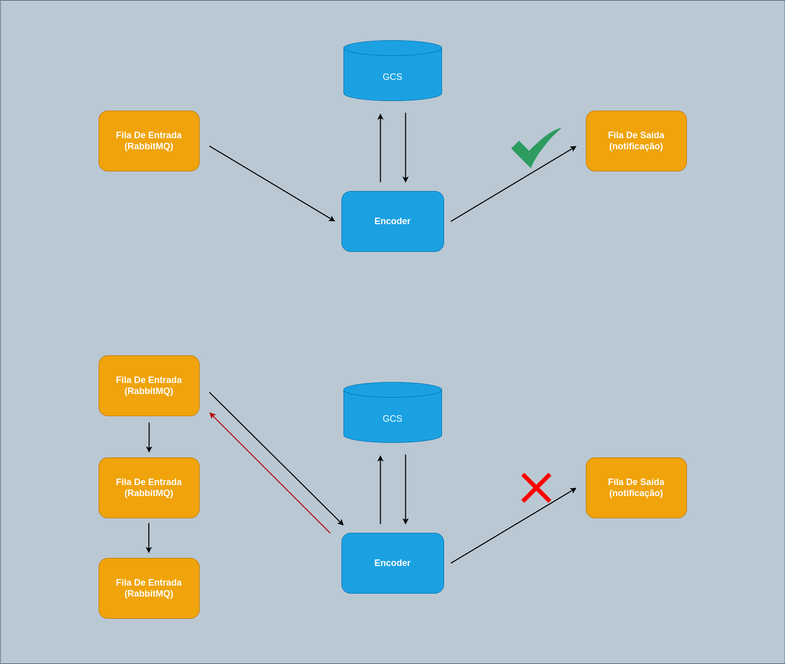

### Fluxo

- Recebe uma mensagem via RabbitMQ informando qual o vídeo deve ser convertido
- Faz download do vídeo no Google Cloud Storage
- Fragmenta o Vídeo
- Converte o Vídeo para MPEG-DASH
- Faz o upload do vídeo no Google Cloud Storage
- Envia uma notificação via fila com as informações do vídeo convertido ou informando erro na conversão
- Em caso de erro, a mensagem original enviada via RabbitMQ será rejeitada e encaminhada diretamente a uma Dead Letter Exchange

### Dinâmica

- O Microsserviço de encoder de vídeos vai ficar lendo a fila de entrada e vai ficar recebendo mensagens. Quando ele receber uma mensagem para fazer a conversão de um vídeo, ele vai pegar essa mensagem, vê qual é o vídeo que ele tem que converter, acessa o GCS, faz o upload do arquivo, realiza todo o processo de conversão, faz novamente o upload do arquivo para o GCS e ai vai finalmente notificar que o vídeo foi convertido com sucesso.
- Caso ocorra um erro, a fila de saída vai receber uma notificação de que algo deu ruim. O encoder vai pegar a mensagem que foi enviada originalmente para ele e vai dar um reject nela, uma vez que essa mensagem foi rejeitada, iremos encaminha-la para uma Dead Letter Exchange (DLX) e essa exchange automaticamente encaminha essa mensagem para uma Dead Letter Queue (DLQ).
- Essa queue é basicamente uma fila que ficará guardando todas essa mensagens que tiveram problema, para que caso a gente queira, consultemos essa fila para tentar entender o por que tivemos problema com a mensagem.



#### Formato de mensagem de entrada

```json
{
  "resource_id": "46c058ce-292b-4daf-97b3-062ef60605d5",
  "file_path": "caminho_do_video.mp4"
}
```

#### Formato de mensagem de saída - SUCESSO

```json
{
  "job_id": "46c058ce-292b-4daf-97b3-062ef60605d5",
  "output_bucket_path": "nome_do_bucket",
  "status": "COMPLETED",
  "video": {
    "encoded_video_folder": "64c058ce-292b-4daf-97b3-062ef606055d",
    "resource_id": "46c058ce-292b-4daf-97b3-062ef60605d5",
    "file_path": "caminho_do_video.mp4"
  },
  "Error": "",
  "created_at": "2023-04-25T22:25:36.850479-04:00",
  "updated_at": "2023-04-25T22:25:36.081754-04:00"
}
```

#### Formato de saída - ERRO

```json
{
  "message": {
    "resource_id": "46c058ce-292b-4daf-97b3-062ef60605d5",
    "file_path": "caminho_do_video.mp4"
  },
  "error": "Motivo do erro"
}
```

### Pontos importantes

- O sistema deverá processar diversas mensagens de forma paralela/concorrente.
- Um simples MP4 quando convertido para MPEG-DASH é segmentado em múltiplos arquivos de áudio e vídeo, logo o processo de upload não é apenas de um único arquivo.
- O processo de upload também deve ser feito de forma paralela/concorrente